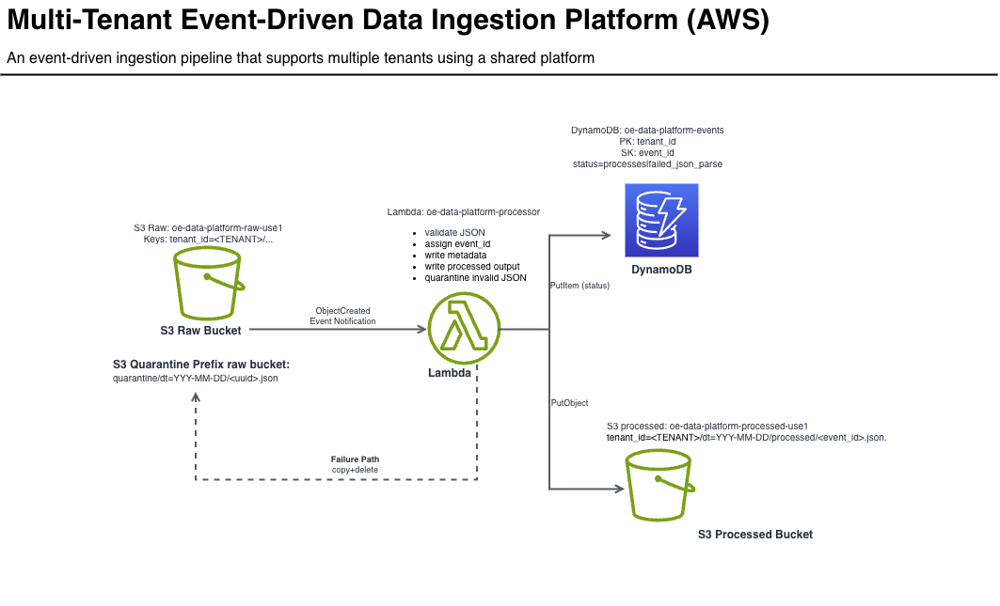

# Multi-Tenant Event-Driven Data Ingestion Platform (AWS Serverless)

**Architecture:** S3 (raw) → Lambda (processor) → DynamoDB (metadata) → S3 (processed)

**Failure handling:** invalid JSON is quarantined in S3 and recorded in DynamoDB

## Architecture

## Why this exists
A reference architecture demonstrating multi-tenant ingestion, event-driven processing, metadata indexing, and operational failure handling under AWS Free Tier constraints.

## Data flow
1. Upload JSON to the raw bucket under a tenant-scoped key (e.g., `tenant_id=test/...`)
2. S3 triggers the Lambda processor
3. Lambda validates JSON and assigns `event_id` if missing
4. Writes a metadata record to DynamoDB (`tenant_id`, `event_id`, status)
5. Writes processed output to the processed bucket
6. On invalid JSON: moves the object to `quarantine/` and records failure status

## Multi-tenancy model
Tenant isolation is encoded via S3 object key prefixes:

`tenant_id=<TENANT_ID>/...`

DynamoDB uses a composite key:
- Partition key: `tenant_id`
- Sort key: `event_id`

## How to test
Upload a valid event:
- `sample-events/valid_event.json` → raw bucket path: `tenant_id=test/...`

Upload an invalid event:
- `sample-events/invalid_event.json` → raw bucket path: `tenant_id=test/...`

Verify:
- Processed objects appear in the processed bucket
- Metadata records appear in DynamoDB
- Invalid files move to `quarantine/` with a failure record

## System design doc
https://www.notion.so/Designing-a-Multi-Tenant-Event-Driven-Data-Ingestion-Platform-AWS-303ba72b40de80e5a1fed650f11062db?source=copy_link)

## Next upgrades (optional)
- Idempotency (prevent duplicate processing on retries)
- Schema validation (JSON Schema)
- Dead-letter queue (SQS) for failed invocations
- Metrics (CloudWatch EMF) for processed/failed counts
